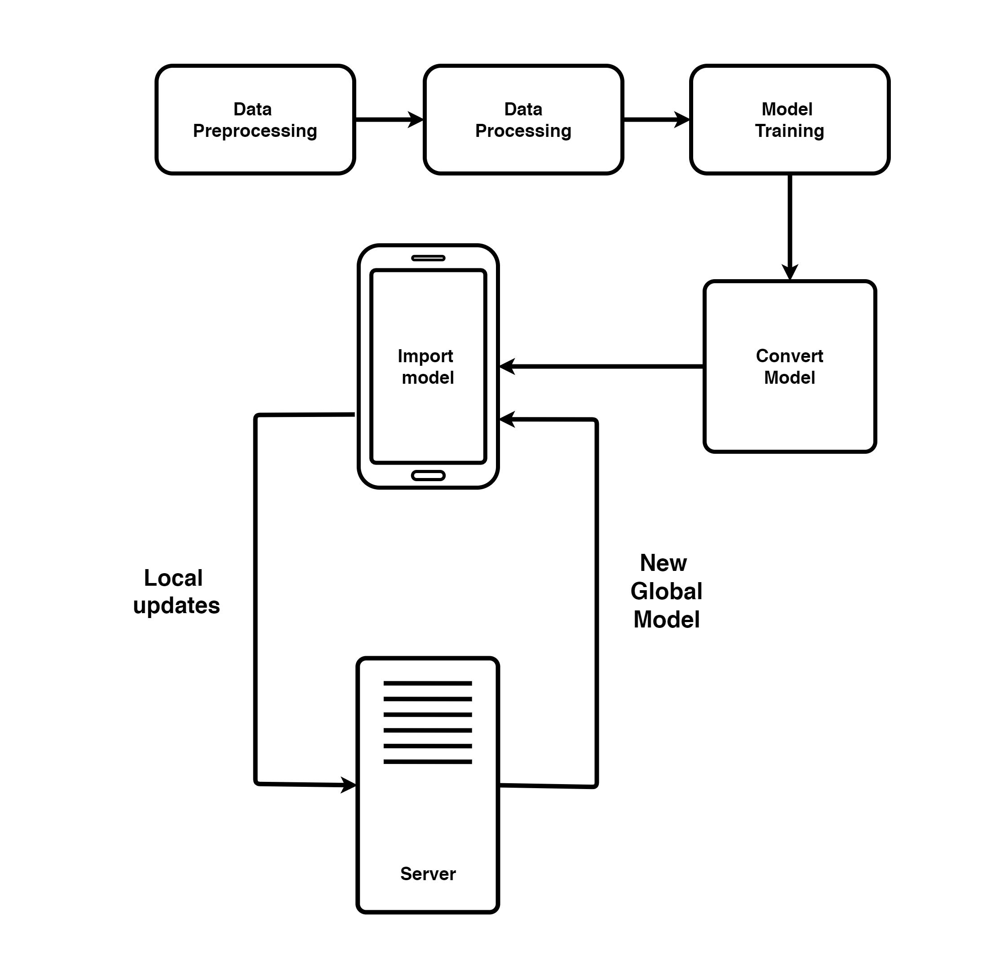

# Next Word Prediction in Smartphone using Federated Learning #

In the present time, people are obsessed with using smartphones for their work, entertainment, personal affairs etc. One of the main problems faced by almost all smartphone users is that while chatting or typing anything, they have to write long sentences which at times becomes very frustrating and time-consuming. When we type using our PCs, it is not very difficult but when it comes to typing using a smartphone, which is smaller than a PC, the scenario becomes different and it gets irritating and difficult at the same time for many people. In this project, we will try to develop something for the small devices which will predict the next word(s) possible or suitable after the word(s) typed by the user. Therefore, one does not have to write the whole sentence, the algorithm will predict the next word for the user. This project will require knowledge from fields such as statistics, machine learning, federated learning, Recurrent Neural Networks (RNN) etc. We train an RNN language model using a distributed, on-device learning framework known as federated learning for the purpose of next word prediction in smartphones. The main goal of this project is to help users of small devices to text as fast as possible. Also in this project, we are going to develop a mobile application in which we will implement the algorithms of next word prediction. The implementation of federated learning into our project will help us to personalize the prediction of the next word(s) using personal writing history.

# Datasets

A [movie dialog dataset](https://www.cs.cornell.edu/~cristian/Cornell_Movie-Dialogs_Corpus.html) is used in this project. This dataset contained the dialogues of different characters of different movies.

# Implementation 

WorkFlow of the project 

 

    

 

Some features and screenshots of the implementated mobile application is described below:

- ## Word prediction process

    The process in which the deep learning model does the prediction operation in a real time device using the
    mobile application is shown below:

     

    

        
        
    

- ## Restrict mode and theme switching feature

    When restrict mode is enabled, the users history will not be saved that means no violation of privacy policies. User can change the theme of the app based on their liking.

     

    

        
          
    

- ## Test on Assamese words

    The model was also trained and tested with a regional language which is Assamese.

     

    

        
        
    

- ## Updating model

    The mobile application automatically updates the model during the time period 2 am to 4 am. The screenshots while the update was going on and when the update was completed by the application are given below:

     

    

        
        
    

- ## Settings page

    The mobile application consists of a settings page where the users can manage the partial appearance of the application according to their respective preferences. The features included in the settings page are as follows:

     

    
 
        
        
    

     

    -   **Change the count of the predicted words:**  
            According to the individual needs, different users can keep different predicted word count from 2 to 10.

    -   **Change the radius of border outlines:**  
            Different users can use different shapes of the borders according to their taste.

    -   **Change the theme:**  
            According to the preferences of the users, they have the provision of using different themes.

## Full Working of the Application
    
 

https://user-images.githubusercontent.com/30615934/177505404-4d8b164d-8b72-4d77-9082-18a9bf95915f.mp4
    
## Collaborator

[Ojosmita Bachistha Goswami](https://github.com/Ojosmita)